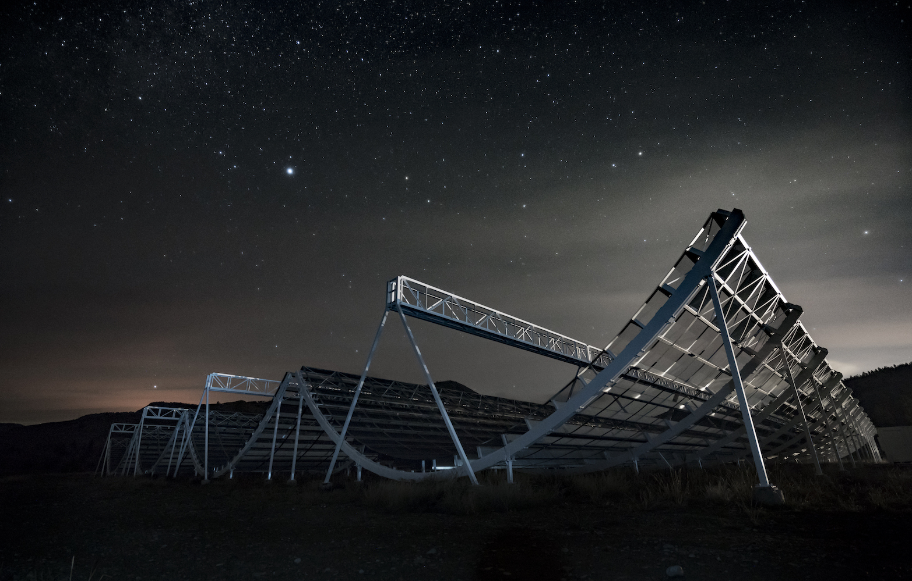

+++
title = "Research"
template = "simple-section.html"
+++

### Overview
I am primarily interested in analyzing radio data and extract scientific information from that to better understand the Universe and learn fundamental physics. 
To probe the history and evolution of the Universe I use the 21 cm line emission of neutral hydrogen, which can be used to trace the cosmic history.
Below a more detailed description of my research is provided.

## Line Intensity Mapping

My research interest is in understanding the formation and evolution of the large-scale structure
of the Universe. I use large surveys of the sky to answer the question of how a smooth early Universe 
evolved over cosmic time and formed the large complex structure that we see in the present day Universe. 
I am currently focused on [Line Intensity Mapping](https://arxiv.org/abs/1903.04496) technique, where we make 
a diffuse sky map at frequencies corresponding to atomic/molecular lines originating in galaxies or the intergalactic 
medium and then measure the statistical fluctuation of the radiation field to understand the structure 
formation at large scales. I am particularly interested in the observation of [21 cm line of neutral hydrogen](https://arxiv.org/abs/astro-ph/9608010)
and measuring the auto-correlation power spectrum of the radiation field to map the distribution of matter in
the Universe. By measuring the statistical signal in the data, [the baryon accoustic oscillation](https://arxiv.org/abs/1201.2434) 
, we will be able to constrain the rate of expansion of the Universe and use this to probe the nature of
[dark energy](https://en.wikipedia.org/wiki/Dark_energy). Currently, I am heavily involved in two
projects trying to do this:

## CHIME

<!--

-->

The Canadian Hydrogen Intensity Mapping Experiment, [CHIME](https://chime-experiment.ca/),  is a novel radio interferometer built at the
[Dominion Radio Astrophysical Observatory](https://nrc.canada.ca/en/research-development/nrc-facilities/dominion-radio-astrophysical-observatory-research-facility)
near Penticton in British Columbia. CHIME is designed for mapping the distribution of neutral hydrogen between
redshifts 0.8 and 2.5, and constraining the equation of state of dark energy at a key
epoch. For an overview of CHIME see {{ arxiv(id="2201.07869") }}. CHIME started collecting data from 2018.
After the initial deployment and commissioning phase, we used data from 2019 and released our first 
science results, where we detected cosmological HI 21 cm signal in  cross-correlations of CHIME data against optical catalogs from eBOSS ({{ arxiv(id="2202.01242") }}).

CHIME is currently taking data and we are working our way towards BAO measurements. My main contribution is to develop software pipeline to measure the 
auto-correlation power spectrum using CHIME data only. I am involved in understanding various systematics present in the data and removing those to detect the cosmological
signal from neutral hydrogen. 

{{ scaledimage(src="chime.jpg", alt="CHIME at night. Photo by Andre Renard", width="70%") }}

## CHORD

<!---->

The Canadian Hydrogen Observatory and Radio-transient Detector, [CHORD](https://www.chord-observatory.ca/home)
is a radio interferometer currently under development that will be built at the
[Dominion Radio Astrophysical Observatory](https://nrc.canada.ca/en/research-development/nrc-facilities/dominion-radio-astrophysical-observatory-research-facility).
 CHORD will consist of 512 dishes of 6m diameter each arranged in a compact redundant array {{ arxiv(id="1911.01777") }}. CHORD will operate between 
 300 to 1500 MHz and have a deep dish structure with f/D = 0.21. For more details about the feed design, system temperature measurement, etc, please see {{ arxiv(id="2210.07477") }}. 
 Using bandwidth × field of view × sensitivity as a figure of merit, CHORD will be an order of magnitude more powerful than its predecessor CHIME, and be the world-leading facility of its type.
 
The building of the first 66 dishes (pathfinder) is underway. I am currently involved in software development for calibration and the simulation pipeline for CHORD, 
where we will be using a novel calibration algorithm [Corrcal](https://arxiv.org/abs/1701.01860). 
 

{{ scaledimage(src="chord.jpg", alt="CHORD", width="70%") }}

## Science with GMRT

In the past, during my Ph.D,  I have done significant work on understanding Foregrounds, 
developing pipelines for calibration and RFI flagging for the upgraded wideband correlator system of Giant MetreWave Radio Telescope, [GMRT](http://www.ncra.tifr.res.in/ncra/gmrt), to search for the diffuse HI 21 cm signal at redshift 1.96 to 3.58. 
The [GMRT](https://www.currentscience.ac.in/Volumes/113/04/0707.pdf) is one of the largest and most sensitive fully operational low-frequency radio telescopes in the world situated in Pune, India.
 The array consists  of 30 antennas, each of 45 m diameter,  spread over distances of upto 25 km.
 
 {{ scaledimage(src="GMRT_Pune.jpg", alt="GMRT", width="70%") }}
 
  Using GMRT I studied the statistical properties of the Diffuse Galactic synchrotron radiation and effect of DI and DD calibration ({{ arxiv(id="1906.01655") }}), the distribution of point sources and spectral properties of galactic foreground ({{ arxiv(id="1908.10380") }}), the angular clustering properties of 
 different source populations, such as AGNs, SFGs, etc ({{ arxiv(id="2002.12383") }}). I also have investigated the effect of missing channels due to RFI flagging in the estimation
of cosmological HI power spectrum ({{ arxiv(id="2203.04994") }}). Finally, I put the constraint on the cosmological HI signal at redshift 1.96-3.58 using the uGMRT for the first time ({{ arxiv(id="2012.04674") }}).

 {{ scaledimage(src="Upper_lim.jpg", alt="Upper lim", width="100%") }}
 
 
I am still working on developing and improving the calibration algorithm and RFI mitigation strategy at low-frequency to improve the limit on HI signal using GMRT.

## Strong Gravitational Lensing: A nature's gift

I also work on the observation of HI 21 cm line emission from an individual galaxy at high redshift using strong gravitational lensing. This 21 cm is the only direct tracer of the neutral atomic gas content in a galaxy.  Unfortunately, this hyperfine transition is highly forbidden,  hence the strength of this emission line is extremely weak. It is nearly impossible to detect this line emission from a distant galaxy at redshift above 0.4  using the existing telescope in the world. The measurement of HI masses of individual galaxies at redshift greater than one would require a very long integration time with today's radio telescope or the large collecting area of the [Square Kilometer Array](https://www.skao.int/) (SKA).

 {{ scaledimage(src="strong_lensing.png", alt="lens", width="100%") }}
 
However, one can use the strong gravitational lens, nature’s gift, which magnifies the weak emission signal coming from distant objects, enabling us to peer through the high redshift universe. We used this technique and reported the first detection of HI 21 cm emission from a star-forming galaxy at redshift 1.3 (nearly 9 billion years ago) using uGMRT ({{ arxiv(id="2301.05987") }}). In
our study, the weak 21cm emission signal from the distant background galaxy is strongly boosted by the gravitational lens an early-type elliptical galaxy, which resides in between us (the observer) and the background galaxy. Due to the strong magnification by the lens, we are able to detect the HI 21cm emission from the distant background galaxy and measure  the atomic hydrogen mass of this individual galaxy at such a large cosmological distance for the first time with a moderate  telescope observing time. 

{{ scaledimage(src="spectrum_im.jpg", alt="lens", width="100%") }}

The most accurate listing of my papers can be found here [NASA ADS]("https://ui.adsabs.harvard.edu/search/q=docs(library%2F0M0G3dsjSNeXotLDUmsR6Q)&sort=date%20desc%2C%20bibcode%20desc&p_=0").

